# Prompt 

In der Datei <Glossar> findest du Eigenschaften von Senioren. Erstelle daraus bitte ein UML-Klassendiagramm in PlantUML-Syntax. Das Klassendiagramm soll die Eigenschaften (Capabilities) von Senioren übersichtlich darstellen. Verwende nur Klassen und Attribute, 
keine Methoden, keine Stereotype, keine Pakete. Speichere bitte dieses Modell in domaenenmodell.puml. 

# Kommentar zum Ergebnis ChatGPT
Muss noch deutlich überarbeitet werden, nur erster Wurf. In der Überarbeitung
besonders die Inhalte der WHO berücksichtigen, auch bei der Präzisierung des Glossars. 

https://www.who.int/news-room/questions-and-answers/item/healthy-ageing-and-functional-ability

# Ergebnis ChatGPT (August 2026)

```plantuml
@startuml

skinparam classAttributeIconSize 0
skinparam shadowing false
skinparam linetype ortho

class Senior {
  selbststaendig: Boolean
}

class IntrinsischeKapazitaet {
  gehen: Boolean
  denken: Boolean
  sehen: Boolean
  hoeren: Boolean
  erinnern: Boolean
}

class FunktionaleFaehigkeit {
  grundbeduerfnisseErfuellen: Boolean
  entscheidungenTreffen: Boolean
  mobilSein: Boolean
  beziehungenAufrechterhalten: Boolean
  gesellschaftlichBeitragen: Boolean
}

class Selbststaendigkeit {
  aktivitaetenSelbststaendigDurchfuehren: Boolean
  anforderungenSelbstBewaltigen: Boolean
}

class KoerperlicheFaehigkeit {
  vorhanden: Boolean
}

class Mobilitaet {
  positionswechsel: Boolean
  sitzen: Boolean
  umsetzen: Boolean
  fortbewegung: Boolean
  treppensteigen: Boolean
}

class KognitiveUndKommunikativeFaehigkeiten {
  denken: Boolean
  erinnern: Boolean
  orientierung: Boolean
  problemloesen: Boolean
  entscheidungsfaehigkeit: Boolean
  kommunikation: Boolean
}

class Sinnesfaehigkeit {
  sehen: Boolean
  hoeren: Boolean
}

class Hoerfaehigkeit {
  sprachverstehen: Boolean
  telefonverstehen: Boolean
  verstehenBeiGeraeuschen: Boolean
}

class Sehfaehigkeit {
  nahsehen: Boolean
  fernsehen: Boolean
}

class Aktivitaet {
  aufgabeDurchfuehren: Boolean
  aktivitaetsbeeintraechtigung: Boolean
}

class Partizipation {
  inLebenssituationEinbezogen: Boolean
  teilhabebeeintraechtigung: Boolean
}

class SozialeTeilhabe {
  kommunikation: Boolean
  sozialeBeziehungen: Boolean
  gesellschaftlicheBeteiligung: Boolean
}

class BeeintraechtigungDerFunktionsfaehigkeit {
  koerperlich: Boolean
  kognitiv: Boolean
  psychisch: Boolean
}

class KognitiveBeeintraechtigung {
  denkenEingeschraenkt: Boolean
  erinnernEingeschraenkt: Boolean
  orientierungEingeschraenkt: Boolean
  problemloesenEingeschraenkt: Boolean
  entscheidungsfaehigkeitEingeschraenkt: Boolean
}

class Demenz {
  gedächtnisBeeinträchtigt: Boolean
  denkenBeeinträchtigt: Boolean
  alltagsbewaeltigungBeeinträchtigt: Boolean
}

class Hoerbeeintraechtigung {
  ausmass: String
  sprachverstehenErschwert: Boolean
}

class Sehbeeintraechtigung {
  nahsehenEingeschraenkt: Boolean
  fernsehenEingeschraenkt: Boolean
}

class Sinnesbeeintraechtigung {
  sehenEingeschraenkt: Boolean
  hoerenEingeschraenkt: Boolean
}

class Multimorbiditaet {
  anzahlChronischerErkrankungen: Integer
}

class Pflegebeduerftigkeit {
  hilfeDurchAndereErforderlich: Boolean
  voraussichtlicheDauerMonate: Integer
}

class Pflegehilfsmittel {
  pflegeErleichtern: Boolean
  beschwerdenLindern: Boolean
  selbststaendigkeitErmoeglichen: Boolean
}

class Sturzrisiko {
  durchMobilitaetBeeinflusst: Boolean
  durchKognitionBeeinflusst: Boolean
  durchSehenBeeinflusst: Boolean
}

Senior "1" *-- "1" IntrinsischeKapazitaet
Senior "1" *-- "1" FunktionaleFaehigkeit
Senior "1" *-- "1" Selbststaendigkeit
Senior "1" o-- "0..1" BeeintraechtigungDerFunktionsfaehigkeit
Senior "1" o-- "0..1" Pflegebeduerftigkeit
Senior "1" o-- "0..1" Multimorbiditaet

IntrinsischeKapazitaet "1" *-- "1" KoerperlicheFaehigkeit
IntrinsischeKapazitaet "1" *-- "1" KognitiveUndKommunikativeFaehigkeiten
IntrinsischeKapazitaet "1" *-- "1" Sinnesfaehigkeit
KoerperlicheFaehigkeit "1" *-- "1" Mobilitaet
Sinnesfaehigkeit "1" *-- "1" Hoerfaehigkeit
Sinnesfaehigkeit "1" *-- "1" Sehfaehigkeit

FunktionaleFaehigkeit "1" o-- "0..*" Aktivitaet
FunktionaleFaehigkeit "1" o-- "0..*" Partizipation
FunktionaleFaehigkeit "1" o-- "1" Selbststaendigkeit
Partizipation <|-- SozialeTeilhabe

BeeintraechtigungDerFunktionsfaehigkeit "1" o-- "0..1" KognitiveBeeintraechtigung
KognitiveBeeintraechtigung "0..1" <-- "0..1" Demenz
Hoerfaehigkeit "1" <-- "0..1" Hoerbeeintraechtigung
Sehfaehigkeit "1" <-- "0..1" Sehbeeintraechtigung
Sinnesfaehigkeit "1" <-- "0..1" Sinnesbeeintraechtigung

BeeintraechtigungDerFunktionsfaehigkeit "1" --> "0..1" Pflegebeduerftigkeit
BeeintraechtigungDerFunktionsfaehigkeit "1" --> "0..1" Sturzrisiko
Mobilitaet "1" --> "0..1" Sturzrisiko
KognitiveUndKommunikativeFaehigkeiten "1" --> "0..1" Sturzrisiko
Sehfaehigkeit "1" --> "0..1" Sturzrisiko
Pflegebeduerftigkeit "1" o-- "0..*" Pflegehilfsmittel

@enduml
```
