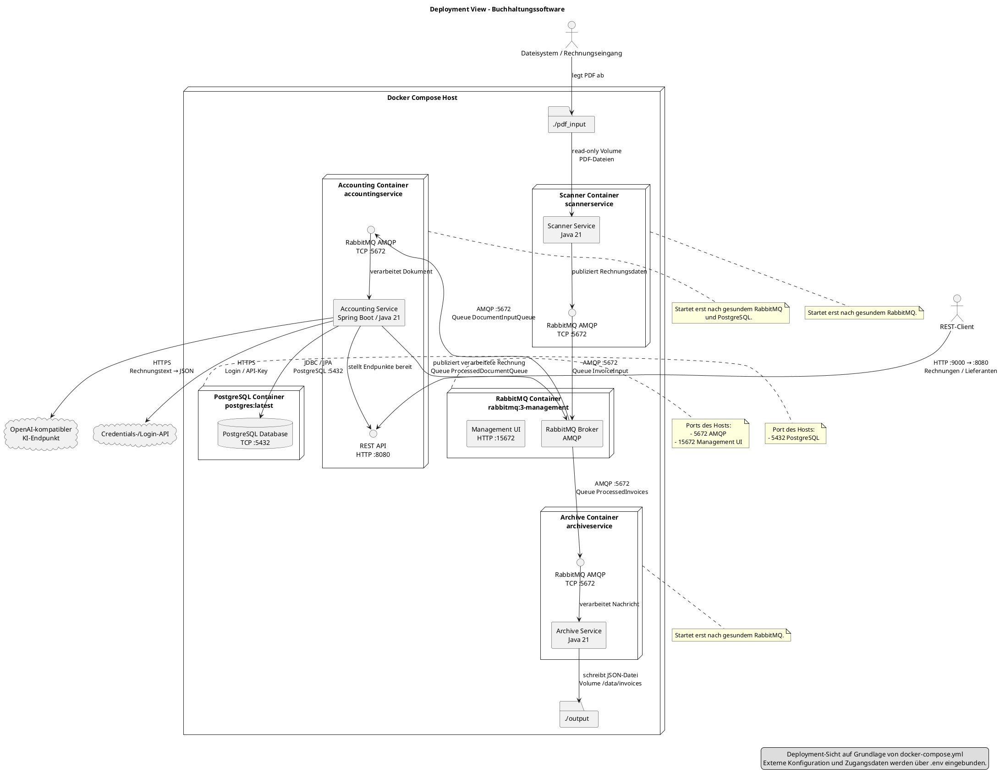

# Verteilungsarchitektursicht z.B. aus docker-compose.yml

## Prompt
Erstelle bitte auf der Grundlage der Datei docker-compose.yml eine Verteilungsarchitektur-Sicht (Deployment-View im C4-Modell) mit Containern, Schnittstellen und Kommunikationswegen. Bitte verwende PlantUML.

## Kommentar

Generiertes Diagramm ist erstmal eine gute Basis. 
Sollte noch mal deutlich vereinfacht werden. Leider wurde beim
Generieren nicht das C4-Modell verwendet, sondern eine Variante 
des UML-Verteilungsdiagramms (erstmal auch OK).
 
## Ergebnis (Codex, August 2026)
